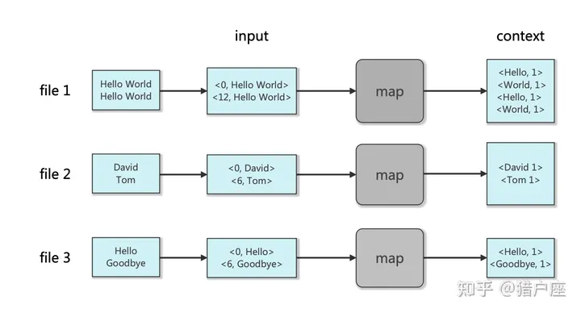
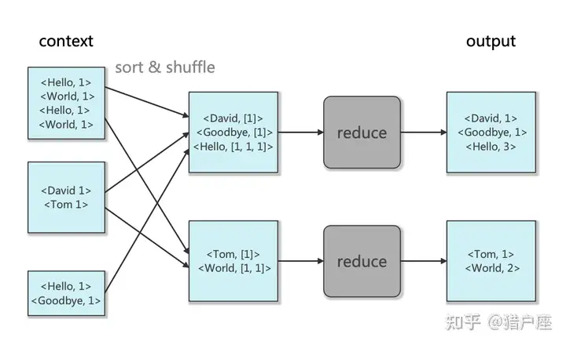

## 0. 单词计数(Word Count)的MapReduce实现

map过程的示意图如下：



reduce 函数示意图如下：



梳理逻辑是：

启动一个`master`(coordinator) 和多个`worker`，`master`进程启动一个`rpc`服务器，每个`worker`进程通过`rpc`机制向`Master`要任务，任务可能包括`map`和`reduce`过程。

`map`进程将每个出现的单词机械地分离出来，每个单词和它出现的次数以`key-value`**键值对**形式记录。将键值对存储到 `mr-*` 文件中，其中 `*` 由hash算法得出，从而均匀的分给`reduce进程`。

`reduce`进程对键值对进行排序，然后统计单词(key)个数。最终，每个`reduce`进程都有一个输出，合并这些输出，就是`Word Count`结果。

---

## 1. 代码实现

简单梳理一下逻辑，理清一下思路。

### 1.1 任务分配

根据 hint 首先实现 `worker` 和 `coordinator` 之间的交互，worker 需要不断发送rpc请求任务，因此在rpc.go中需要定义请求的信息。

```go
type Task struct {
	TaskType  TaskType
	TaskId    int
	ReduceNum int
	FileName  []string
}

type TaskType int

const (
	MapTask TaskType = iota
	ReduceTask
	WaittingTask // Waitting 代表此时为任务都分发完了，但是任务还没完成
	ExitTask
)
```

然后 worker 根据请求到的 task 信息调用不同的方法。

```go
func Worker(mapf func(string, string) []KeyValue,
	reducef func(string, []string) string) {
	// Your worker implementation here.
	for {
         // 调用 Coordinator.GetTask
		task := CallGetTask()
		switch task.TaskType {
		case MapTask:
			doMapTask(&task, mapf)
			callDone(&task)
		case ReduceTask:
			doReduceTask(&task, reducef)
			callDone(&task)
		case WaittingTask:
			// 等待一段时间再请求
			time.Sleep(5 * time.Second)
			continue
		case ExitTask:
			time.Sleep(time.Second)
			fmt.Println("exit task")
			return
		}
	}
}
```

可以看到 worker 通过请求 coordinator 的 GetTask 方法获取任务，下面实现：

首先需要定义 coordinator 的结构体，下面是完整的代码，在具体实现中可以先定义两个 chan ，后续根据代码需要再不断增加。

```go
type Coordinator struct {
	// Your definitions here.
	files          []string
	reduceNum      int // 启动多少个 reducer
	MapTaskChan    chan *Task
	ReduceTaskChan chan *Task
	TaskMetaHolder TaskMetaHolder // 保存所有 task 的元信息，访问时需要上锁
	Phase          Phase // master 处于什么阶段？
	nextTaskID     int   // 主键自增来生成 TaskID
}

// 存储 Task 的元信息
type TaskInfo struct {
	state     State
	startTime time.Time
	ptr       *Task
}

type TaskMetaHolder struct {
	TaskInfoMap map[int]*TaskInfo
}

// State 任务的状态的父类型
type State int

// State 状态类型
const (
	Working State = iota // 此阶段在工作
	Waiting              // 此阶段在等待执行
	Done                 // 此阶段已经做完
)

// Phase 对于分配任务阶段的父类型
type Phase int

// 枚举阶段的类型
const (
	MapPhase    Phase = iota // 此阶段在分发MapTask
	ReducePhase              // 此阶段在分发ReduceTask
	AllDone                  // 此阶段已完成
)
```

协调者的初始化：

```go
// create a Coordinator.
// main/mrcoordinator.go calls this function.
// nReduce is the number of reduce tasks to use.
func MakeCoordinator(files []string, nReduce int) *Coordinator {
	c := Coordinator{
		files:          files,
		reduceNum:      nReduce,
		MapTaskChan:    make(chan *Task, len(files)),
		ReduceTaskChan: make(chan *Task, nReduce),
		TaskMetaHolder: TaskMetaHolder{
			TaskInfoMap: make(map[int]*TaskInfo, len(files)+nReduce), // 任务总数为 file + reducer
		},
		Phase: MapPhase,
	}
	// 初始化map任务
	c.makeMapTasks(files)
	// 启动rpc服务器
	c.server()
    // 启动协程监测worker是否崩溃
	go c.crashDetector()
	return &c
}
```

然后实现 makeMapTasks：

```go
// 初始化 map task
func (c *Coordinator) makeMapTasks(files []string) {
	for _, file := range files {
		id := c.generateTaskID()
		task := Task{
			TaskType:  MapTask,
			TaskId:    id,
			ReduceNum: c.reduceNum,
			FileName:  []string{file},
		}
		// 任务初始状态
		taskInfo := TaskInfo{
			state: Waiting,	// 等待执行
			ptr:   &task,
		}
		// 将 task 状态保存在 master 中
		c.TaskMetaHolder.putTask(&taskInfo)
		fmt.Println("making a map task :", &task)
		c.MapTaskChan <- &task	// 存入 chan
	}
	fmt.Println("done making map tasks")
}
```

下面就可以实现协调者的分发逻辑，将map任务管道中的任务取出，如果取不出来，说明任务已经取尽，那么此时任务要么就已经完成，要么就是正在进行。判断任务map任务是否先完成，如果完成那么应该进入下一个任务处理阶段（ReducePhase）。

reduce任务的分发和 map 类似。

```go
// 分发任务（核心）
func (c *Coordinator) GetTask(args *TaskRequestArgs, reply *Task) error {
	// 上锁
	mu.Lock()
	defer mu.Unlock()

	switch c.Phase {
	case MapPhase:
		{
			if len(c.MapTaskChan) > 0 {
				*reply = *<-c.MapTaskChan
				if !c.TaskMetaHolder.updateState(reply.TaskId) {
					fmt.Printf("task %v is running", reply.TaskId)
				}
			} else {
				// map task 被分发完 但还没执行完
				reply.TaskType = WaittingTask
				if c.checkPhaseDone() {
					c.nextPhase()
				}
			}
		}
	case ReducePhase:
	case AllDone:
	default:
	}
	return nil
}
```

协调者切换 phase时需要注意，从map阶段切换到reduce阶段时，需要先初始化reduce任务，然后再修改 phase，否则 reduceChan 为空无法分配任务：

```go
// 切换到下一个 phase
func (c *Coordinator) nextPhase() {
	if c.Phase == MapPhase {
		c.makeReduceTasks()
		c.Phase = ReducePhase
	} else if c.Phase == ReducePhase {
		c.Phase = AllDone
	}
}
```


### 1.2 map 实现

map 的流程：调用 mapf 方法处理输入生成一组 kv，然后调用json库写到temp文件中，temp命名无所谓。使用temp的原因是防止程序崩溃，这样用户不会读取到崩溃后错误的文件。`在完成全部写入操作后原子化的重命名文件`。

首先读取输入生成中间键值对，然后使用哈希算法为不同的key选择不同的 reduce task：

```go
	// 获取 kv 键值对
	intermediate = mapf(filename, string(content))

	nReduce := task.ReduceNum
	// 根据 key 选择还原任务
	kvHash := make([][]KeyValue, nReduce)
	for _, kv := range intermediate {
		// use the ihash(key) to pick the reduce task for a given key
		kvHash[ihash(kv.Key)%nReduce] = append(kvHash[ihash(kv.Key)%nReduce], kv)
	}
```

中间文件的合理命名约定是 `mr-X-Y` ，其中 X 是映射任务编号，Y 是还原任务编号。参考 mrsequential.go：

```go
	for i := 0; i < nReduce; i++ {
		// 临时文件
		tmpfile, err := ioutil.TempFile("", "mr-tmp-*")
		if err != nil {
			log.Fatalf("cannot create temp file: %v", err)
		}
		defer os.Remove(tmpfile.Name())

		// 将 kv 键值对 存储在 JSON 文件中
		enc := json.NewEncoder(tmpfile)
		for _, kv := range kvHash[i] {
			err := enc.Encode(&kv)
			if err != nil {
				log.Fatalf("encode error: %v", err)
			}
		}
		tmpfile.Close()

		// 原子操作重命名
        fn := fmt.Sprintf("mr-" + strconv.Itoa(task.TaskId) + "-" + strconv.Itoa(i))
		os.Rename(tmpfile.Name(), fn)
	}
}
```

任务完成后，worker 通过 rpc 请求 coordinator，修改元数据信息。

```go
// worker 完成任务后调用
func (c *Coordinator) MarkFinished(t *Task, reply *Task) error {
	mu.Lock()
	defer mu.Unlock()

	info, ok := c.TaskMetaHolder.TaskInfoMap[t.TaskId]
	if ok && info.state == Working {
		info.state = Done
	} else {
		fmt.Printf("%v %v is already finished", t.TaskType, t.TaskId)
	}
	return nil
}
```


### 1.3 reduce 实现

首先当 coordinator 切换到 reduce phase 时，初始话 reduce 任务。makeReduceTasks 和map的初始化相似，不同的是，一个map task只需要处理一个输入文件，而一个 reduce task 需要处理多个中间文件。

`filepath.Glob("mr-*-" + strconv.Itoa(id))` 能匹配所有符合条件的中间文件。（中间文件的合理命名约定是 `mr-X-Y` ，其中 X 是映射任务编号，Y 是还原任务编号。）

```go
// 选择 reduce 的文件
func selectReduceFile(id int) []string {
	files, err := filepath.Glob("mr-*-" + strconv.Itoa(id))
	if err != nil {
		fmt.Println("selectReduceFile: pattern unmatched")
	}
	return files
}
```

然后在 worker 中实现，reduce 的流程：根据 task 信息读取所有中间文件的 kv 键值对，然后进行排序。同样的，排序后 reduce 的结果先存储到临时文件，全部完成后再重命名。参考 mrsequential.go：

```go
	// 从 JSON 文件中读取 kv 键值对
	var intermediate []KeyValue
	for _, fileName := range task.FileName {
		file, _ := os.Open(fileName)
		dec := json.NewDecoder(file)
		for {
			var kv KeyValue
			if err := dec.Decode(&kv); err != nil {
				break
			}
			intermediate = append(intermediate, kv)
		}
		file.Close()
	}
	sort.Sort(ByKey(intermediate))

	// 调用 reducef 存储到临时文件
	i := 0
	for i < len(intermediate) {
		j := i + 1
		// 处理所有相同的key
		for j < len(intermediate) && intermediate[j].Key == intermediate[i].Key {
			j++
		}
		values := []string{}
		for k := i; k < j; k++ {
			values = append(values, intermediate[k].Value)
		}
		// 既然返回的是 len(values) = j - i, 是否不需要 values？
		output := reducef(intermediate[i].Key, values)
		// this is the correct format for each line of Reduce output.
		fmt.Fprintf(tmpfile, "%v %v\n", intermediate[i].Key, output)

		i = j
	}
```


### 1.4 coordinator 的一些补充

主键自增的方法，生成 task id 时调用。

```go
// 返回 c.nextTaskID，然后自增
func (c *Coordinator) generateTaskID() int {
    ret := c.nextTaskID
    c.nextTaskID++
    return ret
}
```

更新 phase 的逻辑：1. map 全部完成 2. reduce 全部完成

需要注意的是，在 reduce 阶段，map 一定是全部完成的！！！因此写逻辑 1 时不能只判断 map 的完成情况，同时还要保证当前不在 reduce 阶段：可以使用 phase 判断，也可以使用 `reduceDoneNum == 0 && reduceUnDoneNum == 0`。

```go
// 判断该 phase 是否结束,输出当前 phase 完成情况
func (c *Coordinator) checkPhaseDone() bool {
    var (
       mapDoneNum      = 0
       mapUnDoneNum    = 0
       reduceDoneNum   = 0
       reduceUnDoneNum = 0
    )
    for _, info := range c.TaskMetaHolder.TaskInfoMap {
       if info.ptr.TaskType == MapTask {
          if info.state == Done {
             mapDoneNum++
          } else {
             mapUnDoneNum++
          }
       } else if info.ptr.TaskType == ReduceTask {
          if info.state == Done {
             reduceDoneNum++
          } else {
             reduceUnDoneNum++
          }
       }
    }

    if (mapDoneNum > 0 && mapUnDoneNum == 0) && (reduceDoneNum == 0 && reduceUnDoneNum == 0) {
       return true
    }
    if reduceDoneNum > 0 && reduceUnDoneNum == 0 {
       return true
    }

    return false
}
```

检测崩溃的函数：任务分配后，在 task 的元数据里面更新 starttime 信息，超过十秒回收任务，并更新任务状态为 waiting。

```go
// 检测崩溃
func (c *Coordinator) crashDetector() {
    for {
       time.Sleep(2 * time.Second)
       mu.Lock()
       if c.Phase == AllDone {
          mu.Unlock()
          break
       }

       // 检测是否运行超过 10s
       for _, info := range c.TaskMetaHolder.TaskInfoMap {
          if info.state == Working && time.Now().Sub(info.startTime) >= 10*time.Second {
             switch info.ptr.TaskType {
             // 回收任务
             case MapTask:
                c.MapTaskChan <- info.ptr
                info.state = Waiting
             case ReduceTask:
                c.ReduceTaskChan <- info.ptr
                info.state = Waiting
             }
             fmt.Printf("crash detected task %v\n", info.ptr.TaskId)
          }
       }

       mu.Unlock()
    }
}
```


## 2. 可能存在的bug

### 2.1 多打log

多写 printf，在完成一个重要阶段后，输出一下。

### 2.2 shell 脚本

`wait -n` 是一个 Bash 4.3 及以上版本提供的功能，用于等待任意一个子进程完成。


